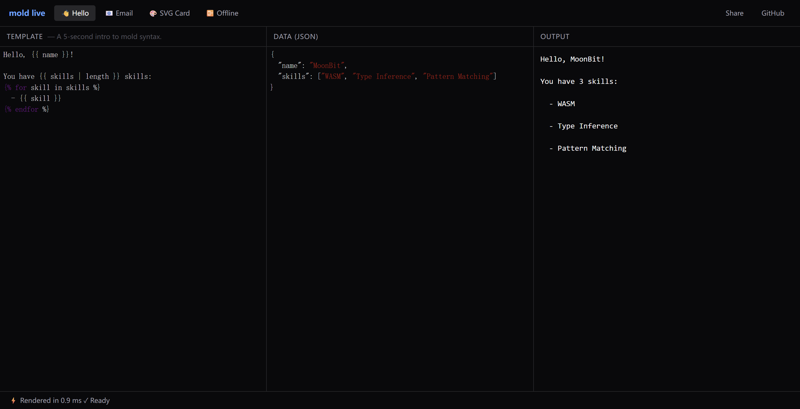

# MoldLive 实施规格说明书

> 本文档是给 AI Coding Agent（Claude Code / OpenCode / Cursor Agent）执行的工程规格。  
> 阅读对象：能写 TypeScript、能调 WASM、不需要产品讨论的实施者。  
> 输出对象：一个可部署到 GitHub Pages 的静态站点。

---

## 0. 项目基本信息

- **项目名**：`mold-live`
- **仓库位置**：`github.com/<owner>/mold-live`（独立仓库，不放在 mold 主仓库里）
- **部署目标**：GitHub Pages，域名 `mold-live.dev`（暂用 `*.github.io` 也可）
- **技术约束**：纯静态站点，无后端，无构建期 Node 依赖运行时

---

## 1. 技术栈（强约束，不要替换）

| 项 | 选择 | 不要替换的理由 |
|---|---|---|
| 语言 | TypeScript（strict 模式） | 类型安全 |
| 框架 | **不使用前端框架**，原生 DOM | 减少 bundle，体现"轻"的卖点 |
| 构建 | Vite | 零配置、产物干净 |
| 样式 | Tailwind CSS（通过 Vite 插件，不要用 CDN） | 生产环境 tree-shake |
| 编辑器 | CodeMirror 6（`@codemirror/*` 模块化包） | 轻量，可自定义语法高亮 |
| WASM 运行时 | 浏览器原生 `WebAssembly` API | 不引入 wasm-bindgen 等 |
| 部署 | GitHub Actions → GitHub Pages | 标准流程 |

**禁止引入**：React、Vue、Svelte、jQuery、Bootstrap、Monaco Editor、任何 UI 组件库。

---

## 2. 仓库目录结构

```
mold-live/
├── .github/
│   └── workflows/
│       └── deploy.yml              # GitHub Pages 自动部署
├── public/
│   ├── mold.wasm                   # mold 编译产物（占位，先放空文件）
│   └── favicon.svg
├── src/
│   ├── main.ts                     # 入口
│   ├── style.css                   # Tailwind 入口
│   ├── wasm/
│   │   ├── loader.ts               # WASM 加载与初始化
│   │   └── bridge.ts               # JS ↔ WASM 字符串桥接
│   ├── editor/
│   │   ├── template-editor.ts      # 左栏：模板编辑器
│   │   ├── data-editor.ts          # 中栏：JSON 编辑器
│   │   ├── output-view.ts          # 右栏：输出展示
│   │   └── mold-syntax.ts          # mold 语法高亮模式
│   ├── examples/
│   │   ├── index.ts                # 示例注册中心
│   │   ├── hello.ts
│   │   ├── email.ts
│   │   ├── svg-card.ts
│   │   └── offline-report.ts
│   ├── ui/
│   │   ├── topbar.ts               # 顶栏（Examples Tab、Share、GitHub）
│   │   ├── statusbar.ts            # 底部状态栏（耗时、体积、错误）
│   │   └── layout.ts               # 三栏布局
│   ├── state/
│   │   ├── store.ts                # 中央状态（模板、数据、输出、错误）
│   │   └── url-sync.ts             # URL hash ↔ 状态同步
│   └── utils/
│       ├── debounce.ts
│       └── encode.ts               # base64url 编解码
├── index.html
├── tailwind.config.js
├── postcss.config.js
├── vite.config.ts
├── tsconfig.json
├── package.json
└── README.md
```

---

## 3. WASM 接口契约（已更新）

> **2026-05-28 更新**：mold 的 WASM 导出层已就绪（`src/wasm-export/`），采用 wasm-gc + JS String Builtins 提案，接口与原文不同。以下为实际可用接口。

mold 编译出的 `mold.wasm` 暴露以下导出函数：

```typescript
// src/wasm/bridge.ts 中的 TypeScript 镜像类型

interface MoldWasmExports {
  // 核心渲染 — MoonBit String ↔ JS string 通过 externref 零拷贝
  // 入参: template 字符串, data JSON 字符串
  // 返回: JSON 信封字符串
  //   成功: {"output":"渲染结果"}
  //   失败: {"error":{"kind":"template|json","message":"...","line":1,"column":3}}
  mold_render(template: string, dataJson: string): string;

  // 模块初始化入口（加载后调用一次）
  _start(): void;
}

// JS 端加载方式
const { instance } = await WebAssembly.instantiate(wasmBytes, {}, {
  builtins: ["js-string"],
  importedStringConstants: "_",
});
instance.exports._start();
const result: string = instance.exports.mold_render(template, dataJson);
```

**与原文 C-ABI 方案的关键差异**：
- 无 `alloc` / `dealloc` / `free_result`（GC 托管）
- 无线性内存（`memory`），字符串通过 `externref` 直接映射
- 始终返回 JSON 信封，通过是否有 `error` 字段区分成功/失败（无歧义）
- 错误带 `line` / `column` / `message`，8 种 `MoldError` 变体逐一映射
- 浏览器支持：Chrome 128+，Node.js 24.13.1+

---

### 原始 C-ABI 契约（已过时，仅作历史参考）

---

## 4. 状态模型

```typescript
// src/state/store.ts

interface AppState {
  template: string;              // 当前模板源码
  dataJson: string;              // 当前数据 JSON（字符串形式，未解析）
  output: string;                // 最近一次成功的渲染输出
  outputMode: 'text' | 'svg';    // 输出展示模式（SVG Card 示例用 svg）
  renderMs: number;              // 最近一次渲染耗时
  error: RenderError | null;     // 当前错误（模板错误或 JSON 错误）
  activeExample: string;         // 当前激活的示例 id
  wasmReady: boolean;            // WASM 是否加载完成
  wasmSizeKb: number;            // WASM 体积（gzip 前），加载后填入
}

interface RenderError {
  kind: 'template' | 'json';
  message: string;
  line?: number;
  column?: number;
}
```

状态变更使用最简发布订阅：

```typescript
class Store {
  private state: AppState;
  private listeners: Set<(s: AppState) => void>;

  get(): AppState;
  set(patch: Partial<AppState>): void;     // 浅合并并触发订阅
  subscribe(fn: (s: AppState) => void): () => void;
}
```

**禁止使用 Redux、Zustand、Jotai 等状态库**。

---

## 5. 渲染流水线

```
template 变化 ─┐
              ├─→ debounce(150ms) ─→ render() ─→ store.set({...})
dataJson 变化 ┘
```

实现细节：

1. **JSON 预校验**：在调 WASM 前先 `JSON.parse` 一次。失败则设置 `error.kind='json'`，不调 WASM，保留上次成功的 `output`。
2. **WASM 调用**：JSON 校验通过后调用 `render()`，传入原始字符串（不是解析后的对象）。
3. **耗时测量**：使用 `performance.now()` 包裹 WASM 调用，结果写入 `renderMs`。
4. **错误处理**：WASM 返回 `ok=0` 时，读取 `err_line/err_col/err_msg`，设置 `error.kind='template'`，保留上次成功的 `output`。
5. **首次渲染**：WASM 加载完成后立即对默认示例渲染一次，不等用户输入。

---

## 6. UI 布局规格

### 6.1 桌面布局（≥ 768px）

```
┌──────────────────────────────────────────────────────────────┐
│  TOPBAR (h-12, border-b)                                     │
├──────────────┬──────────────┬────────────────────────────────┤
│              │              │                                │
│  TEMPLATE    │  DATA        │  OUTPUT                        │
│  (flex-1)    │  (flex-1)    │  (flex-1)                      │
│              │              │                                │
│              │              │                                │
├──────────────┴──────────────┴────────────────────────────────┤
│  STATUSBAR (h-8, border-t, text-xs)                          │
└──────────────────────────────────────────────────────────────┘
```

每栏顶部有一个 `h-9` 的小标题栏（标签 + 副文本），底部是编辑器/输出区。

### 6.2 移动布局（< 768px）

三栏纵向堆叠，每栏可折叠。默认展开"输出"，点击其他栏的标题展开。使用 `<details>` 原生折叠或手写。

### 6.3 配色（Tailwind 类）

| 区域 | 浅色 | 深色（默认） |
|---|---|---|
| 背景 | `bg-white` | `bg-zinc-950` |
| 边框 | `border-zinc-200` | `border-zinc-800` |
| 文字 | `text-zinc-900` | `text-zinc-100` |
| 次级文字 | `text-zinc-500` | `text-zinc-400` |
| 强调色 | `text-blue-600` | `text-blue-400` |

**只做深色模式**，不做浅色切换（简化作用域）。

---

## 7. 顶栏（Topbar）规格

```
┌────────────────────────────────────────────────────────────────┐
│  mold live   [👋 Hello][📧 Email][🎨 SVG][📴 Offline]   [Share] [GitHub]  │
└────────────────────────────────────────────────────────────────┘
```

- **左侧**：`mold live` 文字 logo，`text-blue-400 font-semibold`
- **中部**：4 个示例 Tab，激活态 `bg-zinc-800 text-white`，非激活 `text-zinc-400 hover:text-zinc-200`
- **右侧**：
  - `Share` 按钮：点击后把 URL 复制到剪贴板，显示一个 1.5 秒的 toast"Link copied"
  - `GitHub` 链接：跳转 mold 仓库，新标签页

切换 Tab 时：

1. 用示例的 `template` 和 `dataJson` 覆盖编辑器内容
2. 用示例的 `outputMode` 设置输出展示模式
3. 更新 `activeExample`，触发 URL 同步

---

## 8. 状态栏（Statusbar）规格

格式：

```
⚡ Rendered in 0.8 ms     📦 WASM 187 KB     ✓ Ready
```

错误时把"Rendered in..."替换为：

```
⚠ Template error at line 3, col 12: unexpected token "endfor"
```

WASM 未加载时：

```
⏳ Loading mold.wasm…
```

---

## 9. 示例（Examples）数据结构

```typescript
// src/examples/index.ts

export interface Example {
  id: string;                    // 'hello' | 'email' | 'svg-card' | 'offline-report'
  label: string;                 // Tab 显示名（含 emoji）
  hint: string;                  // 编辑器上方的小字提示
  template: string;
  dataJson: string;
  outputMode: 'text' | 'svg';
}

export const EXAMPLES: Example[];        // 数组，顺序即 Tab 顺序
export const DEFAULT_EXAMPLE_ID = 'hello';
```

### 9.1 Hello（默认）

```typescript
{
  id: 'hello',
  label: '👋 Hello',
  hint: 'A 5-second intro to mold syntax.',
  template: `Hello, {{ name }}!

You have {{ skills | length }} skills:

  - {{ skill }}
`,
  dataJson: `{
  "name": "MoonBit",
  "skills": ["WASM", "Type Inference", "Pattern Matching"]
}`,
  outputMode: 'text',
}
```

### 9.2 Email

```typescript
{
  id: 'email',
  label: '📧 Email',
  hint: 'Real-world template with conditionals, loops, and filters.',
  template: `Subject: Your order #{{ order.id }} is confirmed

Hi {{ customer.name }},

Thanks for your order! Here's your summary:


  {{ item.qty }}× {{ item.name }} — \${{ item.price }}


Subtotal: \${{ order.subtotal }}

Discount: -\${{ order.discount }}

Total: \${{ order.total }}

— The {{ company }} Team`,
  dataJson: `{
  "customer": { "name": "Alice" },
  "company": "Acme",
  "order": {
    "id": "10234",
    "items": [
      { "name": "Notebook", "qty": 2, "price": 12 },
      { "name": "Pen", "qty": 5, "price": 3 }
    ],
    "subtotal": 39,
    "discount": 5,
    "total": 34
  }
}`,
  outputMode: 'text',
}
```

### 9.3 SVG Card

```typescript
{
  id: 'svg-card',
  label: '🎨 SVG Card',
  hint: 'Output is rendered as an image. Try changing the color.',
  template: `<svg xmlns="http://www.w3.org/2000/svg" width="400" height="220" viewBox="0 0 400 220">
  <rect width="400" height="220" rx="12" fill="{{ bg }}"/>
  <text x="24" y="60" font-family="sans-serif" font-size="28" font-weight="700" fill="{{ fg }}">{{ name }}</text>
  <text x="24" y="92" font-family="sans-serif" font-size="16" fill="{{ fg }}" opacity="0.8">{{ title }}</text>
  <text x="24" y="180" font-family="monospace" font-size="14" fill="{{ fg }}" opacity="0.6">{{ url }}</text>
</svg>`,
  dataJson: `{
  "name": "Robin Fang",
  "title": "Building mold for MoonBit",
  "url": "mold-live.dev",
  "bg": "#0c0a09",
  "fg": "#fafafa"
}`,
  outputMode: 'svg',
}
```

### 9.4 Offline Report

```typescript
{
  id: 'offline-report',
  label: '📴 Offline',
  hint: 'Works without a network. Try going offline.',
  template: `# Sales Report — {{ period }}

**Generated:** {{ generated_at }}

## Summary

- Total Revenue: \${{ summary.revenue }}
- Orders: {{ summary.orders }}
- Avg Order Value: \${{ summary.aov }}

## Top Products


{{ loop.index }}. **{{ p.name }}** — \${{ p.revenue }} ({{ p.units }} units)


---
*This report runs entirely in your browser. No data was sent to any server.*`,
  dataJson: `{
  "period": "May 2026",
  "generated_at": "2026-05-28",
  "summary": { "revenue": 184200, "orders": 1247, "aov": 147.7 },
  "top_products": [
    { "name": "Widget Pro", "revenue": 52000, "units": 320 },
    { "name": "Gadget X", "revenue": 38400, "units": 240 },
    { "name": "Tool Kit", "revenue": 21800, "units": 150 }
  ]
}`,
  outputMode: 'text',
}
```

---

## 10. 输出区（Output View）规格

根据 `outputMode` 切换展示：

- **`text`**：`<pre>` 中显示，`whitespace-pre-wrap font-mono text-sm`
- **`svg`**：直接 `innerHTML` 注入到一个 `<div>`（信任 mold 输出，因为模板和数据都来自用户自己）。注入失败时 fallback 到 text 模式

**安全提示**：在代码注释中明确写"This playground intentionally trusts user-authored templates. Do not embed third-party templates without sanitization."

---

## 11. mold 语法高亮（CodeMirror 模式）

在 `src/editor/mold-syntax.ts` 中实现一个 CodeMirror 6 的 `StreamLanguage`：

| 模式 | 触发 | 样式 |
|---|---|---|
| 默认文本 | 任意字符 | 默认色 |
| 变量插值 | `{{` 到 `}}` | `tags.variableName`（蓝） |
| 控制语句 | `` | `tags.keyword`（紫） |
| 注释 | `{#` 到 `#}` | `tags.comment`（灰斜） |
| 过滤器 `\| name` | 在 `{{ }}` 内的 `\|` 后标识符 | `tags.function`（橙） |
| 关键字 `if/else/for/in/endif/endfor` | 在 `` 内 | `tags.keyword` 加粗 |

**实现量大约 80 行**，参考 CodeMirror 的 `@codemirror/legacy-modes` 写法。

---

## 12. URL 状态同步

格式：

```
https://mold-live.dev/#example=hello
https://mold-live.dev/#t=<base64url(template)>&d=<base64url(dataJson)>
```

规则：

- 切换 Tab：URL 写 `#example=<id>`，**不写完整模板**（保持 URL 短）
- 用户编辑过模板或数据后：URL 切换为 `#t=...&d=...` 形式
- 页面加载时：优先解析 `t/d`，否则按 `example` 加载，再否则用默认示例
- URL 写入使用 `history.replaceState`，**防抖 500ms**，不污染浏览器历史

实现位置：`src/state/url-sync.ts`，导出 `initUrlSync(store)` 一个函数。

---

## 13. WASM 加载流程（已更新）

```typescript
// src/wasm/loader.ts

export async function loadMold(): Promise<MoldRenderer> {
  // 1. fetch('/mold.wasm')
  // 2. 测量 size，写入 store.wasmSizeKb
  // 3. WebAssembly.instantiate(bytes, {}, {
  //      builtins: ["js-string"],
  //      importedStringConstants: "_",
  //    })
  // 4. instance.exports._start()
  // 5. 返回封装好的 renderer 对象
}

export interface MoldRenderer {
  render(template: string, dataJson: string): RenderResult;
}

export interface RenderResult {
  ok: boolean;
  output?: string;
  durationMs: number;
  error?: { kind: string; message: string; line?: number; column?: number };
}
```

**真实 WASM 渲染实现**：

```typescript
// mold_render 始终返回 JSON 信封
// 成功: {"output":"Hello WASM!"}
// 失败: {"error":{"kind":"template","message":"unclosed interpolation tag","line":1,"column":1}}
//
// 解包逻辑:
//   const raw = instance.exports.mold_render(tmpl, data);
//   const result = JSON.parse(raw);
//   if (result.error) { /* 失败 */ } else { /* result.output 为渲染结果 */ }
```

**Mock 实现**（在真实 WASM 对接前使用）：

```typescript
// 支持: {{ var }}, {{ obj.field }}, ... (含 loop 变量),
//       ... / , {{ expr | length }},
//       {{ expr | default(val) }}, {# comment #}
// 失败时返回 ok=false 并带行号
// 用于让 UI 端可独立开发与演示
```

Mock 与真实实现切换通过 `import.meta.env.VITE_USE_WASM` 环境变量控制，默认 `true`，缺失文件时自动 fallback 到 mock 并在控制台 `console.warn`。

---

## 14. 性能与体积目标（验收标准）

| 指标 | 目标 | 测量方式 |
|---|---|---|
| JS bundle (gzipped) | < 80 KB | `vite build` 后 `gzip -c | wc -c` |
| CSS bundle (gzipped) | < 10 KB | 同上 |
| WASM (gzipped) | < 100 KB（mold 端责任，UI 不控制） | 同上 |
| 首次内容绘制（FCP） | < 1.0 s（4G） | Lighthouse |
| 单次渲染耗时（Hello 示例） | < 5 ms | `performance.now()` |
| Lighthouse Performance | ≥ 95 | Lighthouse |
| Lighthouse Accessibility | ≥ 95 | Lighthouse |

---

## 15. 实施任务拆解（给 Agent 的工单）

每个任务独立可验证，按顺序执行。Agent 完成一项后应能跑 `pnpm dev` 看到对应效果。

### Task 1：项目脚手架

- 初始化 Vite + TypeScript + Tailwind
- 建立第 2 节的目录结构（空文件占位）
- `index.html` 中放一个最简骨架（顶栏 + 三栏 + 状态栏的空 div）
- 跑通 `pnpm dev`，页面显示空骨架

**验收**：`pnpm dev` 打开浏览器，看到深色背景 + 四块占位区域

### Task 2：状态中心 + 工具

- 实现 `src/state/store.ts`（订阅发布）
- 实现 `src/utils/debounce.ts` 和 `src/utils/encode.ts`
- 写单元测试（Vitest），至少覆盖 store 的 set/subscribe 和 base64url 编解码

**验收**：`pnpm test` 全绿

### Task 3：WASM Mock + Loader

- 实现 `src/wasm/loader.ts` 的 Mock 版本
- 暴露 `loadMold()` 和 `MoldRenderer` 接口
- 在 `main.ts` 中调用，渲染一个固定模板 + 数据，把结果 `console.log`

**验收**：浏览器控制台输出 "Hello, MoonBit!"

### Task 4：示例数据

- 完成 `src/examples/*.ts` 全部 4 个文件
- 完成 `src/examples/index.ts` 导出
- 在 `main.ts` 中遍历示例并 console.log 验证数据完整

**验收**：控制台打印 4 个示例的 label

### Task 5：三栏布局 + 编辑器骨架

- 实现 `src/ui/layout.ts`，渲染三栏 DOM 结构
- 集成 CodeMirror 6 到模板栏和数据栏（先用 JS / JSON 默认高亮）
- 输出栏显示纯文本

**验收**：页面有三个真实编辑器，可输入文字

### Task 6：渲染流水线接通

- 编辑器变化 → debounce → 调 mock renderer → 更新 store → 输出栏显示
- 切换 Tab 切换内容
- JSON 校验失败显示错误，保留上次输出

**验收**：默认打开 Hello 示例，看到 "Hello, MoonBit!" 输出。改模板里的 `{{ name }}` 为 `{{ skills }}`，输出实时变化

### Task 7：mold 语法高亮

- 实现 `src/editor/mold-syntax.ts`
- 应用到模板编辑器

**验收**：`{{ }}` `` `{# #}` 颜色不同

### Task 8：顶栏 + 状态栏

- 完成 Tab 切换、Share 按钮、GitHub 链接
- 完成状态栏的耗时、WASM 体积、错误展示

**验收**：4 个 Tab 都能切换内容；点 Share 看到 toast；状态栏数字会变化

### Task 9：URL 状态同步

- 实现 `src/state/url-sync.ts`
- 切换 Tab、编辑模板都会更新 URL
- 直接打开带 hash 的 URL 能恢复状态

**验收**：复制 URL 到无痕窗口打开，状态完整还原

### Task 10：SVG 输出模式

- 输出栏支持 `outputMode='svg'`，注入 innerHTML
- 切到 SVG Card 示例能看到名片图像

**验收**：改 `bg` 颜色，名片实时换色

### Task 11：移动端响应式

- 三栏纵向堆叠
- 顶栏 Tab 横向滚动

**验收**：Chrome DevTools 切到 iPhone 视图，可正常使用

### Task 12：CI/CD

- `.github/workflows/deploy.yml`：push 到 main → `pnpm build` → 发布到 `gh-pages` 分支
- 配置 GitHub Pages 指向 `gh-pages`
- README 加项目说明、截图位、部署链接、TODO

**验收**：push 后 1-2 分钟内站点更新

### Task 13：性能验收

- 跑 Lighthouse，达到第 14 节指标
- 不达标则优化（懒加载 CodeMirror、按示例切片等）

**验收**：四项指标全达标，截图存档

---

## 16. README 模板（仓库根目录）

```markdown
# MoldLive

In-browser playground for [mold](https://github.com/<owner>/mold) — a template engine written in MoonBit, compiled to WASM.

**Live**: https://mold-live.dev



## Why

mold runs anywhere WASM runs. MoldLive proves it by rendering templates 100% in your browser, no server roundtrip.

## Stack

- TypeScript + Vite (no UI framework)
- CodeMirror 6
- Tailwind CSS
- mold compiled to WebAssembly

## Develop

\`\`\`bash
pnpm install
pnpm dev
\`\`\`

## Build

\`\`\`bash
pnpm build
\`\`\`

## TODO

- [ ] Replace mock renderer with real `mold.wasm` once mold exposes the WASM ABI defined in `src/wasm/bridge.ts`
- [ ] Add PWA manifest for full offline mode
- [ ] Persist last template in localStorage as fallback to URL state
```

---

## 17. 给 Agent 的执行约束

1. **严格按 Task 顺序执行**，每完成一项跑一次 `pnpm dev` 自检
2. 不要自作主张引入第 1 节禁止列表里的依赖
3. 不要自作主张改示例文案
4. 所有 TypeScript 文件开 `strict: true`，禁用 `any`，必须用具体类型或 `unknown`
5. 提交信息使用 conventional commits（`feat:` / `fix:` / `chore:`）
6. 每个 Task 完成后单独 commit，便于回溯
7. 真实 mold.wasm 不存在时，**绝对不要尝试自己编译 MoonBit**，只用 mock
8. 遇到歧义：**保守选择 + 在代码 TODO 注释中标记**，不要自由发挥

---

## 18. 交付物清单

执行完毕后仓库应包含：

- [ ] 全部源码（按第 2 节结构）
- [ ] 通过的单元测试（Vitest）
- [ ] 可运行的 `pnpm dev` 和 `pnpm build`
- [ ] GitHub Actions 自动部署配置
- [ ] README + 一张主截图
- [ ] 第 14 节性能指标的 Lighthouse 报告（截图或 JSON）

---

## 你给 Agent 的启动 Prompt（直接复制）

```
请阅读项目根目录的 SPEC.md（即本规格说明书），按第 15 节的 Task 顺序
从 Task 1 开始执行。每完成一项 Task：
1. git commit
2. 在终端输出"Task N done, please verify"
3. 等待我确认后再开始下一项

严格遵守第 1 节的技术栈约束和第 17 节的执行约束。
遇到歧义不要自由发挥，按第 17 节第 7 条处理。
```

---

把这份文档保存为仓库的 `SPEC.md`，然后用第 18 节末尾那个 Prompt 启动 Claude Code 即可。需要我再生成对应的 `package.json`、`vite.config.ts`、`tailwind.config.js` 这些配置文件的具体内容吗？